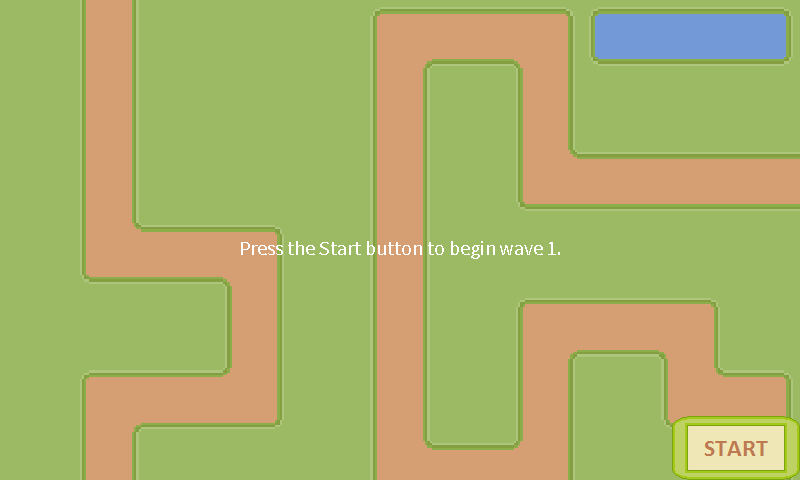
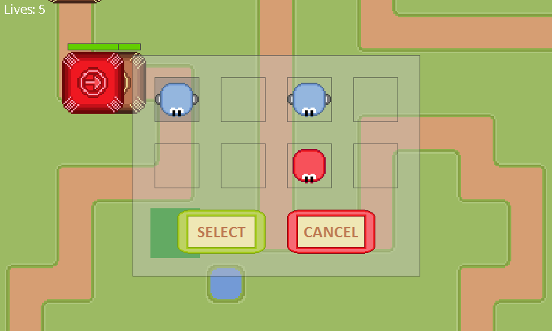
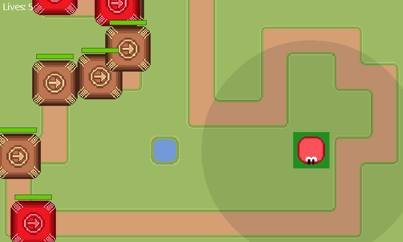
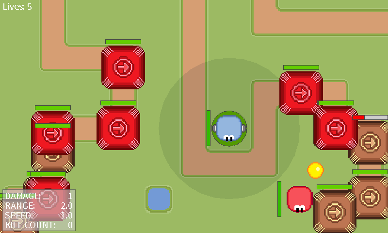

# Beginning of a tower defense game using Android and OpenGL ES

<h2>About</h2>
Project I was working on alone during <b>autumn 2013</b>. The main goal of the project was to just familiarise myself with Android as a game development platform.

<h2>Screenshots</h2>
Start of the game
  
Buying a unit
  
Placing the unit
  
Units engaging enemies

